# Emoji

> Inspired by [kyokomi/emoji](https://github.com/kyokomi/emoji)

A command-line tool for searching Emoji. You can check the Emoji you want directly on your `shell` without annoying web search. `Emoji` is written in [Go](https://golang.org/) with support for multiple platforms.


## Installation

*Go (at least Go 1.12) required to build*

1. **Clone repository**

   ```bash
   $ git clone https://github.com/zajann/emoji.git
   # OR
   $ go get github.com/zajann/emoji
   ```

2. **Build**

   ```bash
   $ go build
   ```

   After build, you can see a binary file: `emoji`. I recommend you move the `emoji` to your `$PATH` to directly use it wherever you are. (eg. /usr/local/bin, $HOME/bin)

   

## Usage

- **Basic**

  ```
  $ emoji apple
  ```

- **Multi Keywords**

  You can query with multiple keywords.

  ```
  $ emoji apple banana kiwi
  ```

- **Random**

  Use `-r` option to get Emoji randomly (default outputs: 10)

  ```
  $ emoji -r
  ```

- **Random on number**

  Yon can query on number with `-r` option  to get more or less.

  ```
  $ emoji -r 20
  ```

  

## Demo



- Full Demo

[](https://asciinema.org/a/298893)


## License

[MIT](https://github.com/zajann/emoji/blob/master/LICENSE)
